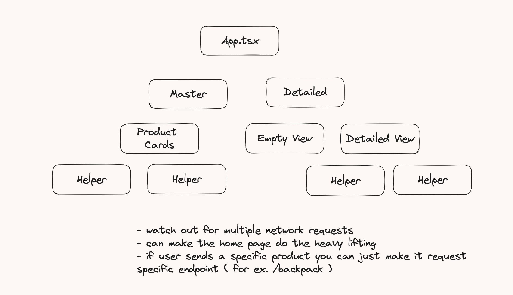

# About Online Store

Desktop View:
<br>

<br>

Mobile View (iPhone11):
<br>

<br>

## About

<p>
Online Store is a <b>fullstack application</b> leveraging <a href="https://fakestoreapi.com/">fake store API</a> as its backend. It features a master and detailed view, full mobile functionality, and is styled utilizing Material UI. 
</p>

**Core Technologies Used:** TypeScript, React.js

## Local Enviornment

Try my Online Store in your local enviornment. First clone my codebase and then run the following commands:

```bash
npm install
```

```bash
npm run dev
```

## Challenge

Design requirements involved:

- Design in Material UI (MUI - a component library)
- Use React
- Use TypeScript

User requirements involved:

- Users should be able to select a product and view it in the detailed view
- Products should reflect whether they are selected or not
- Users should not see a product from default state
- Users should be able to engage with the application in a mobile experience

## Reflections

Overall, this was a fun exercise in state management and practices responsiveness across all devices. Here's a high-level observation of my **component tree**
<br>

<br>
One challenge was lifting state up the component tree – from the helper components up to App. Lifting state is a common practice in React and there are multiple ways to execute this.

<p> For Online Store's use case, the application needs to know which exact product to display in the detailed view. But if we split the App into two containers (detailed and master), how can state be shared? 
</p>

<p> Indeed, this can be solved with state lifting. By extending a callback function from the parent components through to the helper children, when invoked, state from App can be updated and dissimitated to the relevent componants.
</p>

<p> Note that it is faulty to consider this as state "bubbling-up". React uses a uni-directional data flow - you may only transfer data from parent to child and not vice versa. It is more accurate to visualize our practice in Online Store as <b>extension</b>.
</p>

## Things I Would Have Done Differently

<p> In the future, I would have liked to make a single fetch request from the App component and store it as state. This way, I could avoid multiple network calls and limit potential async issues. 
</p>

<p>About optimizing network calls: <strong>caching</strong> fetched data and <strong>reusing</strong> it where applicable can significantly reduce redundant network requests. Employing <strong>debouncing</strong> or <strong>throttling</strong> techniques when dealing with user-initiated requests may aid in better managing frequent or rapid requests to the server, thereby optimizing network traffic.</p>

<p>I could have considered incorporating <strong>lazy loading</strong> for data fetching, especially for components or data not immediately required during the initial render. Additionally, exploring <strong>pagination</strong> or <strong>infinite scrolling</strong> strategies for fetching large datasets incrementally could have enhanced both the user experience and performance by reducing initial data payloads.</p>

## In Progress

Below lists a table of features I currently have in future plans. Thanks for reading!

<div style="display: flex; ">

|        Feature        | Status |
| :-------------------: | :----: |
| React-Library Testing |   ⏳   |
|  Mock Shopping Cart   |   ⏳   |
| Mock Payment Gateway  |   ⏳   |
|  Restyle in Tailwind  |   ⏳   |

<div style="display: flex; margin-left: 30px; margin-top: 25px ">
